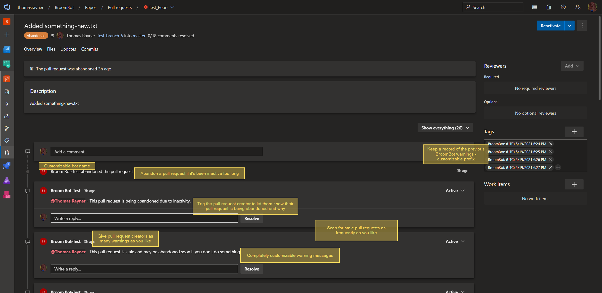

# BroomBot

**BroomBot** is an Azure DevOps Pull Request Minder. Sweep up forgotten and forlorn Azure DevOps Pull Requests with **BroomBot**!

## About

GitHub has a rich ecosystem of bots and helper tools that (among other things) empower repo owners to automatically remind pull request creators to stay on top of their PRs, and clean up stale PRs when they are unattended too long. There are not as many great solutions for this same problem in Azure DevOps, and so **BroomBot** fills that gap.

**BroomBot** periodically checks your Azure DevOps repos for pull requests that haven't been updated in a while and reminds the person who opened it to attend to their PR. After a few reminders, **BroomBot** will abandon the stale PR.

### Features

**BroomBot** is very customizable. **BroomBot** can:

* Scan for stale pull requests as often as you want
* Give as many warnings as you want
* Mark stale pull requests as abandoned once enough warnings have been given
* You can completely customize every message **BroomBot** posts
  * Including tagging the pull request creator in the message
  * Including the name, avatar, description and overall appearance of the bot
* Customize the deployment of **BroomBot** in Azure

## Deploying BroomBot

**BroomBot** is quickly and conveniently deployable into any Azure DevOps organization. 

Click button below to quickly deploy into your org.

For advanced deployment scenarios or more information check out [**BroomBot**'s deployment guide](deployment.md).

## Contributing to BroomBot

Thank you for being interested in contributing to **BroomBot**! **BroomBot** is maintained primarily by a single person with the occasional help of others, and so your contributions are hugely appreciated. Check out [**BroomBot**'s contribution guide](contributing.md) for more information.
