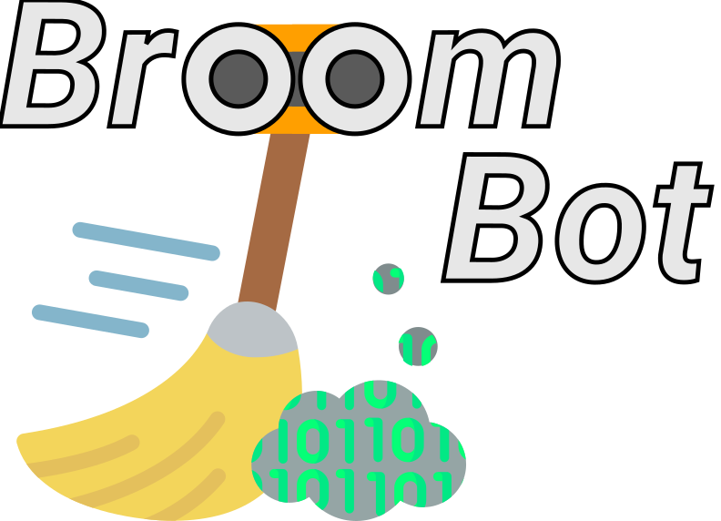

# Deployment

**BroomBot** is designed to be conveniently deployable through the use of Azure Resource Manager (ARM) Templates. Someone deploying **BroomBot** is assumed to have some items already in place, and must provision a few prerequisites prior to deployment.

> Please take care while configuring and deploying **BroomBot**, as misconfigurations may result in unwanted pull request comments and tags, pull request abandonment, or unexpected Azure charges. You deploy **BroomBot** solely at your own risk and discretion.

## Prerequisites

### Already in place

If you are deploying **BroomBot**, one should safely be able to assume that you have an **existing Azure DevOps organization**, and most likely an **Azure subscription**, too. **BroomBot** is an Azure Function that interacts with Azure DevOps. Trials of both products are available, and personal use credits are included with MSDN, among other programs for testing purposes.

### Provisioned prior to deployment

**BroomBot** requires a service account that has the ability to interact with pull requests in the Azure DevOps organization you wish to deploy **BroomBot** to.

* Follow Microsoft's document on [creating a new Azure Active Directory user](https://docs.microsoft.com/en-us/azure/active-directory/fundamentals/add-users-azure-active-directory) while taking care to give your **BroomBot** service account an appropriate name and description (and maybe even an avatar - see [img folder](https://github.com/thomasrayner/BroomBot/tree/main/img)).
* Follow Microsoft's document on [invite **BroomBot**'s service account to your Azure DevOps organization](https://docs.microsoft.com/en-us/azure/devops/organizations/accounts/add-external-user?view=azure-devops).

## Deployment

### Cloning vs Forking

You can deploy **BroomBot** without creating your own fork by cloning this repo and deploying it. Alternatively, you can create your own fork and deploy that instead. The advantage of cloning is that you don't have to keep your own fork up to date. The advantage of forking is that you can make changes to how **BroomBot** actually functions that may suit your own needs better than the **BroomBot** everybody else uses.

> ### You do **not** need to create your own fork of **BroomBot** to customize:
>
> * Any of the attributes that belong to the **BroomBot** service account (name, avatar, description, etc.)
> * Any of the names or values of the resources create in Azure that are used by **BroomBot** (storage accounts, Azure Functions, etc.)
> * Any of the messages and visible strings that **BroomBot** puts into stale pull requests (warning message, abandonment message, tag prefix)
> * Any of the details related to how frequently **BroomBot** sweeps or how many warnings it gives prior to abandoning a stale pull request

### Configuration

To configure **BroomBot**, you only need to edit two files, both located in the `config` folder. Clean backups of the files in this folder are conveniently stored in the `default_config` folder for you to refer to if needed.

#### `UserStrings.json`

This file contains all of the strings used by **BroomBot** for it's various activities and end-user communication.

> Edit **only** the `value` field for each item in `UserStrings.json`.

| String | Default Value | Description |
|-|-|-|
|`PullRequestIsStale`| @<{0}> - This pull request is stale and may be abandoned soon if you don't do something. | The message that is written by **BroomBot** as a comment on a stale pull request. Use @<{0}> to tag the creator of the pull request. You may wish to include information on what to do with the pull request or who the pull request creator may wish to contact for help. |
|`PullRequestIsAbandoned`| @<{0}> - This pull request is being abandoned due to inactivity. | The message that is written by **BroomBot** as a comment on a stale pull request when it is being abandoned. Use @<{0}> to tag the creator of the pull request. This message is only used after the pull request creator has received warnings, and should include acknowledgement that the pull request is being abandoned due to inactivity. |
|`BroomBotName`| BroomBot@your-account.onmicrosoft.com | The Author.Id/UPN property of the service account running **BroomBot**. This information is available from the Azure Portal (as though you wish to view/manage the Azure Active Directory user object for your **BroomBot** service account). |
|`WarningPrefix`| BroomBot | A prefix on the tags **BroomBot** applies to stale pull requests. The tag has the format 'WarningPrefix: (UTC) DateTimeStamp' so maintainers and administrators may keep track of **BroomBot**'s warnings. |
|`StaleAge`| 336 | The number of hours a pull request can go without any activity before the pull request is considered stale. 336 hours (default) is 14 days. There is no way to set an unlimited `StaleAge` at this time, but you can set a functionally unlimited age by using a very high number here. `StaleAge` is converted to an `Int32`, so be careful that the value you use here doesn't exceed `2147483646`. |
|`WarningCount`| 3 | How many warnings are given to a pull request creator before the pull request is abandoned. During a sweep for stale pull requests, if there have been `WarningCount` number of warnings since there has been any activity on a pull request, the pull request will be abandoned. So, pull requests are marked as abandoned by **BroomBot** on the `WarningCount + 1` sweep. There is no way to set an unlimited `WarningCount` at this time, but you can set a functionally unlimited age by using a very high number here. `WarningCount` is converted to an `Int32`, so be careful that the value you use here doesn't exceed `2147483646`. |


#### `BroomBot-ARMDeploy-Params.json`

This file contains all of the parameters used to deploy **BroomBot** to Azure via ARM Template.

> Edit **only** the `value` field for each item in `BroomBot-ARMDeploy-Params.json`.


| String | Default Value | Description |
|-|-|-|
|`functionAppName`| broombotapp | The name of the function app for **BroomBot**. |
|`storageAccName`| broombotstorage | The name of the storage account for **BroomBot**. |
|`storageAccountType`| Standard_LRS | Storage account type for all of **BroomBot**'s artifacts. |
|`location` | West US 2 | Azure region where **BroomBot**'s artifacts are stored and run. |
|`PAT`| `null` | The personal access token for your **BroomBot** service account. (see below*) |
|`organization`| your-organization | The Azure DevOps organization name. |
|`project`| your-project | The Azure DevOps project name inside your organization. |
|`SweepInterval`| 0 0 */12 * * * | NCRONTAB expression for how often sweeps will take place ([more on writing NCRONTAB expressions](https://docs.microsoft.com/en-us/azure/azure-functions/functions-bindings-timer?tabs=csharp#ncrontab-expressions)) |
|`gitHubUrl`| https://github.com/thomasrayner/BroomBot.git | The URL for the GitHub repository that holds **BroomBot**. Azure Functions supports integration with GitHub, and **BroomBot** is designed to be continuously deployed from a GitHub repo. You can use the official **BroomBot** repo (default) or create your own fork. Information on making that decision is above ([Cloning vs Forking](#cloning-vs-forking)). |
|`gitHubBranch`| main | Name of the branch to use when deploying. GitHub repos may have multiple available branches and so you must specify the name of the branch you want to deploy. |

> *After creating the **BroomBot** service account, or at any time afterwards, you must create an Azure DevOps personal access token that includes permission to post comments, apply labels, and abandon pull requests. It is using that PAT that **BroomBot** is able to access Azure DevOps. [Info on setting up a PAT](https://docs.microsoft.com/en-us/azure/devops/organizations/accounts/use-personal-access-tokens-to-authenticate?view=azure-devops&tabs=preview-page#create-a-pat).

### Deploying the ARM Template

After configuration is complete, **BroomBot** can be deployed conveniently using PowerShell with the `Az` module.

```powershell
# Make sure you are in the root of your local clone of BroomBot
Push-Location 'c:\path\to\BroomBot'

# Make the Az module cmdlets available in this session
Import-Module Az

# Connect to the Azure tenant you wish to deploy BroomBot to
Connect-AzAccount

# Optionally select the correct Azure subscription if it is not already selected
# Use Get-AzContext to retrieve a list of accessible Azure subscriptions
Select-AzContext -Name 'your-subscription-name'

# Create an Azure resource group for all of BroomBot's resources - use the same location you specified in BroomBot-ARMDeploy-Params.json
$rgName = 'BroomBot-rg'
New-AzResourceGroup -Name $rgName -Location 'West US 2'

# Deploy the ARM template
New-AzResourceGroupDeployment -Name 'BroomBotDeployment' -ResourceGroupName $rgName -TemplateParameterFile '.\config\BroomBot-ARMDeploy-Params.json' -TemplateFile '.\BroomBot-ARMDeploy.json'
```

The deployment will run, and after some time you will receive output that indicates the `ProvisioningState` is `Succeeded` which means your deployment completed correctly.
